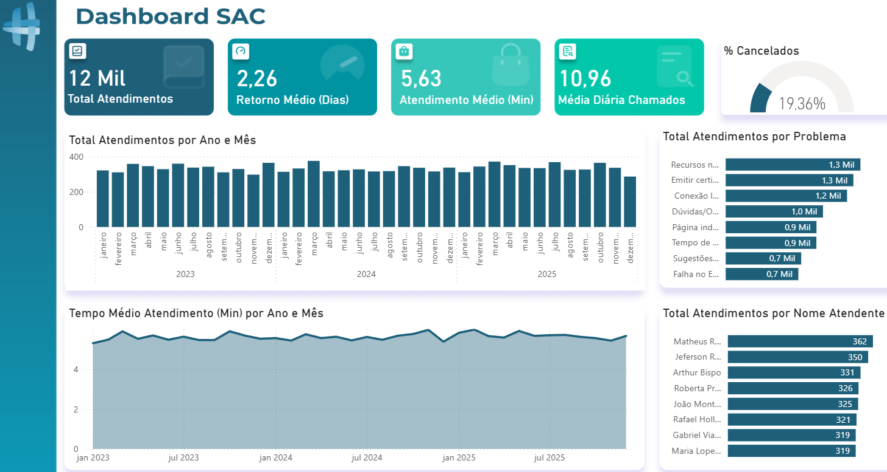

# Dashboard de Gestão de SAC & Experiência do Cliente

Este repositório contém um dashboard analítico focado na operação de SAC (Serviço de Atendimento ao Consumidor). O projeto transforma dados brutos de atendimento em indicadores estratégicos para suporte à tomada de decisão e melhoria de processos.

---

## Preview do Dashboard

  

---

## Objetivo do Projeto
O objetivo principal é monitorar a eficiência operacional da equipe de suporte e a experiência do cliente final. Através deste BI, é possível identificar:
* **Gargalos de Tempo:** Onde o retorno ao cliente está demorando mais.
* **Principais Dores:** Quais problemas geram maior volume de chamados.
* **Desempenho da Equipe:** Produtividade individual e coletiva do time de suporte.

## 🛠️ Engenharia e Modelagem de Dados

O projeto foi construído utilizando as melhores práticas de Business Intelligence, com foco em performance e escalabilidade:

### 1. ETL (Extração, Transformação e Carga)
Os dados foram extraídos de planilhas Excel e tratados via **Power Query**:
* Limpeza de valores nulos e remoção de duplicatas.
* Tratamento de tipos de dados (Data/Hora e Numéricos).
* **Enriquecimento:** Criação de colunas dinâmicas para cálculo de idade dos clientes e tempo de resolução (SLA).

### 2. Modelagem Dimensional (Star Schema)
O modelo de dados segue o padrão **Esquema Estrela**, facilitando a criação de medidas DAX e otimizando o processamento:
* **fOcorrencias (Fato):** Registros transacionais de cada atendimento realizado.
* **dUsuario (Dimensão):** Atributos demográficos dos clientes.
* **dSuporte (Dimensão):** Dados dos analistas responsáveis.
* **dProblema (Dimensão):** Categorização técnica dos chamados.
* **dCalendario (Dimensão):** Tabela de tempo para análises temporais avançadas.

### 3. Principais Métricas DAX
Alguns dos indicadores calculados incluem:
* **Retorno Médio (Dias):** Tempo médio até o primeiro contato.
* **Atendimento Médio (Min):** Tempo médio de duração da interação.
* **% de Cancelados:** Taxa de churn de tickets.
* **Média Diária de Chamados:** Volume médio de entrada de novas demandas.

---

## Insights Extraídos
* **Volume Operacional:** O dashboard processa uma base de **12 mil atendimentos**.
* **Eficiência:** O tempo médio de retorno inicial está fixado em **2.26 dias**.
* **Frequência:** A operação lida com uma média diária de aproximadamente **10.96 chamados**.
* **Pontos Críticos:** Problemas com "Recursos n..." e "Emitir certi..." representam as maiores fatias do volume total, sugerindo a necessidade de melhoria nesses processos específicos.

---

## Como Utilizar este Repositório

### Pré-requisitos
* Ter o [Power BI Desktop](https://powerbi.microsoft.com/desktop/) instalado.

### Passo a Passo
1. Clone o repositório ou baixe os arquivos.
2. Os dados brutos para consulta estão na pasta `/data`.
3. O arquivo do relatório está na pasta `/pbix`.
4. Ao abrir o arquivo `Relatório SAC.pbix`, pode ser necessário atualizar o caminho da fonte de dados para as planilhas da pasta `/data` no seu computador local.

---

## Autor
**Rodrigo Yaedu Pinesso** *Software Engineer & Agile Facilitator* Maringá, PR - Brasil

